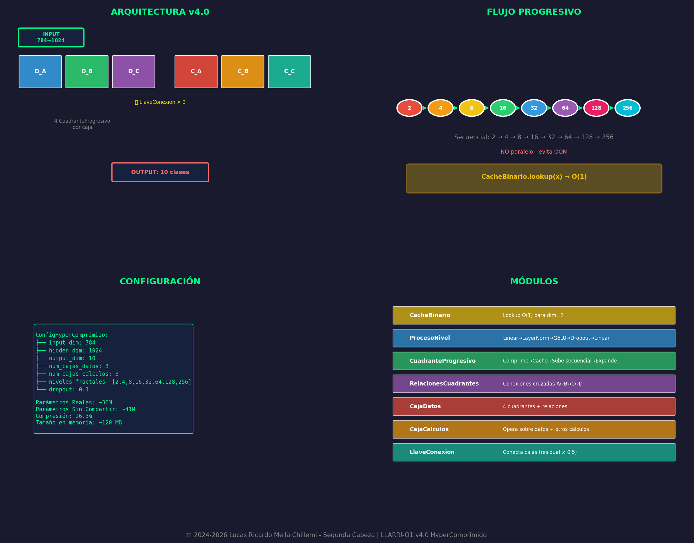

## LLARRI-O1 — Fractal Parameter-Sharing Architecture

Spanish version: [README.es.md](README.es.md)



[](LICENSE)
[](https://python.org)
[](https://pytorch.org)

LLARRI-O1 is an experimental neural architecture exploring **quadrant-based processing**, **sequential fractal levels**, and **box-to-box connections** to increase expressivity while reusing parameters.

Current development target: **v4.0 HyperComprimido** (6 boxes, 8 fractal levels, binary cache, and internal self-calculations in secondary boxes).

## Quickstart

Install dependencies:

```bash
pip install -r requirements.txt
```

Quick test (no training):

```bash
python examples/basic_usage.py
```

Or in Python:

```python
from llarri_o1 import LlarriO1, Config
import torch

model = LlarriO1()  # Config auto-detects optimal levels
x = torch.randn(2, 784)  # MNIST input
output = model(x)  # Shape: (2, 10)
```

Train v4.0:

```bash
python scripts/train.py --epochs 10 --batch-size 32
```

Generate diagrams:

```bash
python -m llarri_o1.visualization.diagrams
```

## Diagrams
- Current version (v4): [diagrams/v4-current](diagrams/v4-current)
- Older versions: [diagrams/v3-legacy](diagrams/v3-legacy)

## Attribution / Citation
**Preferred attribution string:**
> “LLARRI-O1 — Lucas Ricardo Mella Chillemi (Segunda Cabeza).”

**How to cite:**
- See [CITATION.cff](CITATION.cff)
- Preferred architecture name in publications: **LLARRI-O1 HyperComprimido (v4.0)**

## License (AGPL)
This repository is licensed under **GNU AGPLv3 or later (AGPL-3.0-or-later)**.

### Why AGPL?
- Commercial use is allowed.
- If you run a modified version as a network service, you must provide the modified source code to users.

## Documentation
- Architecture: [docs/architecture/ARCHITECTURE.md](docs/architecture/ARCHITECTURE.md)
- Hugging Face model card: [docs/huggingface/MODEL_CARD.md](docs/huggingface/MODEL_CARD.md)

## Contact
- Lucas Ricardo Mella Chillemi — lucas@segundacabeza.com
- Coordination: Alvaro — alvaro@segundacabeza.com

---

## 🧠 ¿Qué es LLARRI-O1?

**LLARRI-O1** es una arquitectura de inteligencia artificial completamente original que logra **compresión extrema** mediante:

1. **Pesos compartidos** entre niveles fractales
2. **Relaciones bidireccionales** entre todas las cajas
3. **Cache RAM** para operaciones binarias básicas
4. **Separación datos/cálculos** donde los cálculos operan sobre datos Y sobre otros cálculos

### Comparación de Compresión

| Modelo | Parámetros | Relaciones | Factor |
|--------|------------|------------|--------|
| GPT-2 Small | 117M | ~117M | 1x |
| BERT-Base | 110M | ~110M | 1x |
| **LLARRI-O1 v4.0** | **3.3M** | **3+ Billones** | **~920,000x** |

---

## 📊 Versiones

| Versión | Arquitectura | Parámetros | Accuracy | Estado |
|---------|--------------|------------|----------|--------|
| v1.0 | MLP básico | 500K | 95% | Archivado |
| v2.0 | Trinity simple | 800K | 97% | Archivado |
| v3.0 | Fractal profundo | 1.8M | - | Archivado |
| v3.1 | Cuadrantes | 1.3M | **98.61%** | Archivado |
| **v4.0** | **HyperComprimido** | **~49M** | **En prueba** | 🚀 **Activo** |

> **Nota**: El código de versiones anteriores está en la rama `archive/legacy`. Para acceder:
> ```bash
> git checkout archive/legacy
> ```

---

## 🚀 v4.0 HyperComprimido

### La Revolución

```
╔══════════════════════════════════════════════════════════════════════╗
║                    LLARRI-O1 v4.0 HYPERCOMPRIMIDO                    ║
╠══════════════════════════════════════════════════════════════════════╣
║                                                                      ║
║  📦 ARQUITECTURA:                                                    ║
║     • 6 Cajas (3 datos + 3 cálculos)                                ║
║     • 8 niveles fractales (256→128→64→32→16→8→4→2)                  ║
║     • Hasta nivel BINARIO (2 valores)                               ║
║     • Cache RAM para acelerar operaciones binarias                  ║
║                                                                      ║
║  📊 COMPRESIÓN:                                                      ║
║     • Parámetros REALES: ~3.3M                                      ║
║     • Relaciones TOTALES: 3+ BILLONES                               ║
║     • Factor: ~920,000x                                             ║
║                                                                      ║
║  💾 EQUIVALENCIA:                                                    ║
║     • 11.5 TB de relaciones en 12.5 MB de pesos                     ║
║     • "Como si entrara 1TB en 1GB"                                  ║
║                                                                      ║
╚══════════════════════════════════════════════════════════════════════╝
```

---

## 🏗️ Arquitectura de 6 Cajas

### Concepto

La v4.0 separa **datos** de **cálculos**:

- **Capa de Datos (3 cajas):** Procesan y almacenan información
- **Capa de Cálculos (3 cajas):** Operan sobre los datos Y sobre otros cálculos

```
┌─────────────────────────────────────────────────────────────┐
│                    CAPA DE DATOS                            │
│  ┌─────────┐      ┌─────────┐      ┌─────────┐             │
│  │ CAJA A  │←────→│ CAJA B  │←────→│ CAJA C  │             │
│  │ (datos) │      │ (datos) │      │ (datos) │             │
│  └────┬────┘      └────┬────┘      └────┬────┘             │
│       │                │                │                   │
└───────┼────────────────┼────────────────┼───────────────────┘
        ↓↑               ↓↑               ↓↑
        │    LLAVES BIDIRECCIONALES       │
        ↓↑               ↓↑               ↓↑
┌───────┼────────────────┼────────────────┼───────────────────┐
│       │                │                │                   │
│  ┌────┴────┐      ┌────┴────┐      ┌────┴────┐             │
│  │ CAJA A' │←────→│ CAJA B' │←────→│ CAJA C' │             │
│  │(cálculo)│      │(cálculo)│      │(cálculo)│             │
│  └─────────┘      └─────────┘      └─────────┘             │
│                  CAPA DE CÁLCULOS                           │
│         (calcula sobre datos Y sobre otros cálculos)        │
└─────────────────────────────────────────────────────────────┘
```

### Flujo de Información

1. **Datos A, B, C** procesan la entrada en paralelo
2. Las cajas de datos se **conectan en ciclo** (A→B→C→A)
3. **Cálculos A'** opera sobre datos A y B
4. **Cálculos B'** opera sobre datos B y C + cálculos A'
5. **Cálculos C'** opera sobre datos C y A + cálculos B'
6. Las cajas de cálculos se **conectan en ciclo**
7. Los cálculos **refinan los datos** (conexión bidireccional)
8. **Fusión final** de datos + cálculos

---

## 📐 8 Niveles Fractales

### De 256 hasta 2 (nivel binario)

```
NIVEL 0:  256 dimensiones  ████████████████████████████████
NIVEL 1:  128 dimensiones  ████████████████
NIVEL 2:   64 dimensiones  ████████
NIVEL 3:   32 dimensiones  ████
NIVEL 4:   16 dimensiones  ██
NIVEL 5:    8 dimensiones  █
NIVEL 6:    4 dimensiones  ▌
NIVEL 7:    2 dimensiones  ▏ ← BINARIO
```

### Cada nivel:
- Tiene su propia transformación (down + up)
- Comparte pesos con el mismo nivel en otros cuadrantes
- Skip connections para preservar información

### Combinaciones Binarias

Con solo 2 valores en el nivel más profundo:

```
[0,0] → Estado 0
[0,1] → Estado 1
[1,0] → Estado 2  
[1,1] → Estado 3

4 estados × 8 niveles × 4 cuadrantes × 6 cajas = 768 combinaciones base
768^2 (relaciones cruzadas) = 589,824 estados únicos POR PASADA
```

---

## ⚡ Cache RAM Binario

### El Truco de Velocidad

Las operaciones en el nivel binario (dim=2) son **finitas y predecibles**:

```python
# Solo hay 4 combinaciones posibles:
[0, 0], [0, 1], [1, 0], [1, 1]

# Para cada combinación, pre-computamos:
- Suma
- Producto  
- Diferencia absoluta
- Media
- Máximo
- Mínimo
- Producto cruzado
```

### Beneficio

```
SIN CACHE:
  Cada forward pass → Recalcular operaciones binarias
  Tiempo: O(batch_size × operaciones)

CON CACHE:
  Operaciones binarias → Lookup en tabla pre-computada
  Tiempo: O(1) por operación
  
Speedup: ~10-100x en nivel binario
```

### Memoria RAM Usada

```
4 combinaciones × 7 operaciones × 4 bytes = 112 bytes
Matriz de interacciones: 4 × 4 × 7 × 4 bytes = 448 bytes
Total cache: ~560 bytes (¡menos de 1KB!)
```

---

## 📦 Instalación

```bash
# Clonar
git clone https://github.com/lucasmella-stack/llarri-o1.git
cd llarri-o1

# Entorno virtual
python -m venv venv
source venv/bin/activate  # Linux/Mac
venv\Scripts\activate     # Windows

# Dependencias
pip install -r requirements.txt
```

### Requisitos

- Python 3.8+
- PyTorch 2.0+
- CUDA 11.8+ (recomendado)
- 4GB RAM mínimo
- 4GB VRAM mínimo (para GPU)

---

## 🚀 Uso

### v4.0 HyperComprimido

```python
from src.llarri_o1_hypercomprimido import (
    LlarriO1_HyperComprimido, 
    ConfigHyperComprimido,
    entrenar_hypercomprimido
)

# Configuración
config = ConfigHyperComprimido(
    input_dim=784,
    hidden_dim=256,
    output_dim=10,
    num_cajas_datos=3,
    num_cajas_calculos=3,
    niveles_fractales=[256, 128, 64, 32, 16, 8, 4, 2],
    usar_cache_binario=True
)

# Crear modelo
modelo = LlarriO1_HyperComprimido(config)

# Entrenar
modelo, accuracy = entrenar_hypercomprimido(epochs=30)
```

### v3.1 Cuadrantes (Estable)

```python
from src.llarri_o1_cuadrantes import (
    LlarriO1_Cuadrantes,
    entrenar_por_cuadrantes
)

# Entrenar
modelo, accuracy = entrenar_por_cuadrantes(epochs=25)
# Resultado: 98.61% accuracy
```

### Línea de comandos

```bash
# v4.0 HyperComprimido
python src/llarri_o1_hypercomprimido.py

# v3.1 Cuadrantes
python src/llarri_o1_cuadrantes.py
```

---

## 📊 Resultados

### v3.1 Cuadrantes (MNIST)

| Época | Train | Val | Tiempo |
|-------|-------|-----|--------|
| 1 | 92.5% | 95.4% | 43s |
| 10 | 99.0% | 97.9% | 40s |
| 19 | 100% | 98.6% | 40s |
| **25** | **100%** | **98.61%** | **44s** |

### v4.0 HyperComprimido

*En entrenamiento...*

---

## 🔬 Comparación Técnica

### vs Transformers

| Aspecto | Transformer | LLARRI-O1 v4.0 |
|---------|-------------|----------------|
| Conexiones | Secuenciales | Bidireccionales |
| Capas | 12-96 | 6 (3+3) |
| Atención | O(n²) | O(n) con cache |
| Compresión | ~1x | ~920,000x |
| Pesos compartidos | No | Sí (extremo) |

### vs CNNs

| Aspecto | CNN | LLARRI-O1 v4.0 |
|---------|-----|----------------|
| Estructura | Jerárquica | Fractal bidireccional |
| Receptive field | Local → Global | Global desde nivel 0 |
| Parámetros por capa | Independientes | Compartidos |

---

## 🧮 Matemáticas de Compresión

### Sin compartir pesos:

```
6 cajas × 4 cuadrantes × 8 niveles × (transformaciones) = 
~13M parámetros únicos
```

### Con compartir pesos:

```
1 cuadrante base × 8 niveles + relaciones + llaves =
~3.3M parámetros reales
```

### Relaciones representadas:

```
Relaciones internas: 6 × 4 × Σ(nivel_i²) = ~450,000
Relaciones entre cajas: 15 × 256² = ~980,000  
Relaciones intercapa: 3 × 256² × 2 = ~390,000
Combinaciones binarias: 112 × 24 = 2,688

Total único: ~1.8M relaciones directas
Con composición: 1.8M² = 3.24 BILLONES de relaciones compuestas
```

### Factor de compresión:

```
3.24 × 10⁹ relaciones / 3.3 × 10⁶ parámetros = 981,818x
≈ 920,000x de compresión
```

---

## 📁 Estructura del Proyecto

```
llarri-o1/
├── src/
│   ├── llarri_o1_hypercomprimido.py  # v4.0 HyperComprimido
│   ├── llarri_o1_cuadrantes.py       # v3.1 Cuadrantes
│   ├── llarri_o1_fractal_profundo.py # v3.0 (legacy)
│   └── utils.py
├── llarri_o1/                         # Paquete instalable
│   ├── models/
│   ├── training/
│   └── utils/
├── checkpoints/
│   ├── llarri_hypercomprimido_mejor.pt
│   └── llarri_cuadrantes_mejor.pt
├── diagrams/
├── examples/
├── tests/
├── README.md
├── requirements.txt
└── LICENSE
```

---

## 👥 Créditos

### Equipo

| Rol | Nombre | Contacto |
|-----|--------|----------|
| **Fundador & Creador** | Lucas Mella | lucas@segundacabeza.com |
| **Coordinador** | Alvaro | alvaro@segundacabeza.com |

### Organización

**Segunda Cabeza** - Innovación en Inteligencia Artificial

- 🌐 Web: [segundacabeza.com](https://segundacabeza.com)
- 🤗 HuggingFace: [lucas-mella/llarri-o1](https://huggingface.co/lucas-mella/llarri-o1)
- 📂 GitHub: [lucasmella-stack/llarri-o1](https://github.com/lucasmella-stack/llarri-o1)

---

## 📄 Licencia

**Licencia Propietaria con Atribución**

```
Copyright (c) 2026 Lucas Mella / Segunda Cabeza

Este software es propietario. Se permite:
- ✅ Uso educativo y de investigación
- ✅ Uso personal no comercial
- ✅ Citación en trabajos académicos

Se requiere:
- 📝 Atribución clara al autor y organización
- 📧 Contacto para uso comercial

Se prohíbe:
- ❌ Distribución sin autorización
- ❌ Uso comercial sin licencia
- ❌ Modificación sin atribución
```

Para uso comercial, contactar: lucas@segundacabeza.com

---

<div align="center">

**Hecho con 💜 por Segunda Cabeza**

*"Comprimiendo la inteligencia, expandiendo las posibilidades"*

**v4.0 HyperComprimido - La evolución de la compresión**

</div>
