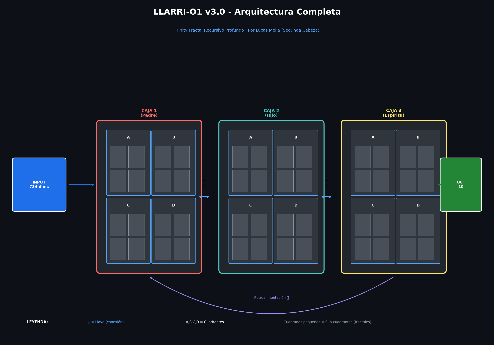
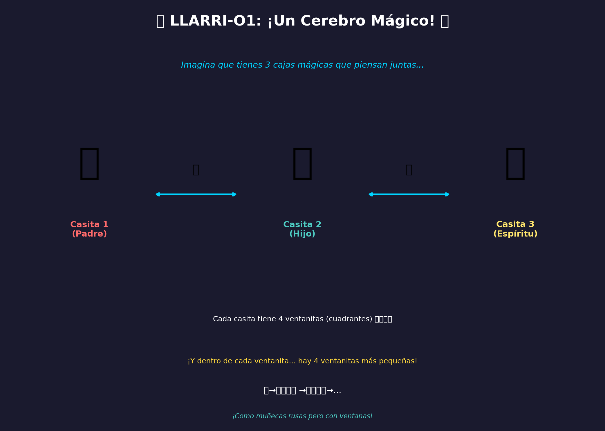
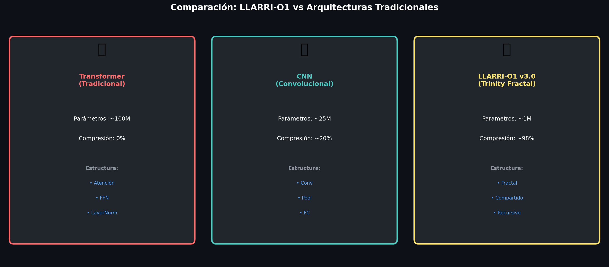

# 🔷 LLARRI-O1 v3.0 - Trinity Fractal Recursivo Profundo

<div align="center">



**Una arquitectura de IA revolucionaria basada en recursión fractal**

[](LICENSE)
[](https://python.org)
[](https://pytorch.org)
[](https://huggingface.co/lucas-mella/llarri-o1)

</div>

---

## 📖 Tabla de Contenidos

- [¿Qué es LLARRI-O1?](#-qué-es-llarri-o1)
- [Explicación Simple (Para Niños)](#-explicación-simple-para-niños)
- [Explicación Técnica](#-explicación-técnica)
- [Arquitectura](#-arquitectura)
- [Instalación](#-instalación)
- [Uso Rápido](#-uso-rápido)
- [Entrenamiento](#-entrenamiento)
- [Resultados](#-resultados)
- [Comparación](#-comparación)
- [Créditos](#-créditos)
- [Licencia](#-licencia)

---

## 🧠 ¿Qué es LLARRI-O1?

**LLARRI-O1** es una arquitectura de inteligencia artificial completamente original, diseñada por **Lucas Mella** de **Segunda Cabeza**.

### La Idea Principal

Imagina que tienes una foto y quieres analizarla. En lugar de procesar cada píxel por separado (como hacen otros modelos), LLARRI-O1 divide la imagen en **cuadrantes**, y cada cuadrante se divide en más cuadrantes, y así sucesivamente... ¡como las muñecas rusas!

Lo revolucionario es que **todos los niveles comparten los mismos "cerebros"** (pesos), lo que permite:

- **98% de compresión** en parámetros
- **Mismo rendimiento** que modelos gigantes
- **Funciona en hardware limitado** (como una GTX 1650)

---

## 🎈 Explicación Simple (Para Niños)



### ¡Piensa en un edificio de apartamentos!

1. **El edificio** tiene 3 casitas (Cajas Trinity)
2. **Cada casita** tiene 4 ventanas (Cuadrantes A, B, C, D)
3. **Dentro de cada ventana**... ¡hay 4 ventanitas más pequeñas!
4. **Y dentro de esas**... ¡otras 4 más pequeñas!
5. ¡Así hasta llegar a la ventanita más pequeña posible!

**El truco mágico:** Todas las ventanas del mismo tamaño funcionan igual. Solo necesitamos aprender UNA vez cómo funciona una ventana de cada tamaño.

Es como si en una escuela, en lugar de tener un profesor por cada estudiante, tuvieras UN profesor que enseña a TODOS porque usan el mismo libro.

---

## 🔬 Explicación Técnica

### Conceptos Clave

#### 1. **Estructura Trinity (3 Cajas)**

```
┌─────────────┐     ┌─────────────┐     ┌─────────────┐
│   CAJA 1    │────▶│   CAJA 2    │────▶│   CAJA 3    │
│   (Padre)   │◀────│   (Hijo)    │◀────│ (Espíritu)  │
└─────────────┘     └─────────────┘     └─────────────┘
       │                                        │
       └────────────────◀───────────────────────┘
                   (Retroalimentación)
```

#### 2. **Cuadrantes por Caja (4 cada una)**

```
┌─────────┬─────────┐
│    A    │    B    │
├─────────┼─────────┤
│    C    │    D    │
└─────────┴─────────┘
```

#### 3. **Recursión Fractal Profunda**

```
Nivel 0: [ABCD] → 256 dims
         ↓
Nivel 1: [a1,a2,a3,a4] × 4 → 64 dims
         ↓
Nivel 2: [α1,α2,α3,α4] × 16 → 16 dims
         ↓
Nivel 3: [β1,β2,β3,β4] × 64 → 4 dims
         ↓
Nivel 4: [γ] × 256 → 1 dim (mínimo)
```

### ¿Por qué funciona?

1. **Pesos Compartidos:** Un solo conjunto de pesos se reutiliza en todos los cuadrantes del mismo nivel
2. **Relaciones Posicionales:** Los cuadrantes se comunican por posición (horizontal, vertical, diagonal)
3. **Llaves Trinity:** Las cajas se comunican con "llaves" (transformaciones lineales)
4. **Retroalimentación:** La Caja 3 envía información de vuelta a la Caja 1

### Matemáticas de Compresión

```
Sin compartir pesos:
- 4^4 niveles × 3 cajas × 4 cuadrantes = 768 conjuntos de pesos

Con compartir pesos:
- 4 niveles × 3 tipos de relación = ~12 conjuntos únicos

Compresión = 768/12 = 64× (98.4% reducción)
```

---

## 🏗️ Arquitectura


### Componentes

| Componente | Descripción |
|------------|-------------|
| `CuadranteFractal` | Unidad recursiva que se subdivide en 4 |
| `CajaTrinityFractal` | Contiene 4 cuadrantes + relaciones |
| `LlaveTrinity` | Conexión entre cajas (ida/vuelta) |
| `LlarriO1_FractalProfundo` | Modelo completo |

### Configuración

```python
@dataclass
class LlarriFractalConfig:
    input_dim: int = 784          # Dimensión entrada
    hidden_dim: int = 256         # Dimensión oculta
    output_dim: int = 10          # Clases de salida
    num_cajas: int = 3            # Cajas Trinity
    cuadrantes_por_nivel: int = 4 # Siempre 4
    profundidad_fractal: int = -1 # -1 = automático
    dim_minima_cuadrante: int = 4 # Mínimo por cuadrante
```

---

## 📦 Instalación

```bash
# Clonar repositorio
git clone https://github.com/lucasmella-stack/llarri-o1.git
cd llarri-o1

# Crear entorno virtual
python -m venv venv
source venv/bin/activate  # Linux/Mac
# o: venv\Scripts\activate  # Windows

# Instalar dependencias
pip install -r requirements.txt
```

### Requisitos

- Python 3.8+
- PyTorch 2.0+
- CUDA 11.8+ (opcional, para GPU)
- 4GB RAM mínimo

---

## 🚀 Uso Rápido

### Crear un modelo

```python
from src.llarri_o1_fractal_profundo import crear_modelo_fractal

# Modelo por defecto (MNIST)
modelo = crear_modelo_fractal(
    input_dim=784,
    hidden_dim=256,
    output_dim=10
)

# Inferencia
import torch
x = torch.randn(32, 784)  # batch de 32 imágenes
output = modelo(x)
print(output.shape)  # [32, 10]
```

### Ver estadísticas de compresión

```python
stats = modelo.get_compression_stats()
print(f"Parámetros: {stats['parametros_reales']:,}")
print(f"Compresión: {stats['compresion_porcentaje']:.1f}%")
print(f"Profundidad: {stats['profundidad_fractal']} niveles")
```

### Ver estructura fractal

```python
print(modelo.get_estructura_fractal())
```

---

## 🎯 Entrenamiento

### Entrenamiento rápido

```bash
cd src
python entrenador_fractal.py
```

### Entrenamiento personalizado

```python
from src.entrenador_fractal import entrenar_modelo_completo

modelo, historial = entrenar_modelo_completo(
    hidden_dim=256,    # Dimensión oculta
    epochs=30,         # Épocas
    batch_size=128,    # Tamaño de batch
    lr=1e-3,           # Learning rate
    profundidad=-1     # -1 = automático
)
```

### Cargar modelo entrenado

```python
import torch
from src.llarri_o1_fractal_profundo import LlarriO1_FractalProfundo

checkpoint = torch.load("checkpoints/mejor_modelo_fractal.pt")
config = checkpoint['config']
modelo = LlarriO1_FractalProfundo(config)
modelo.load_state_dict(checkpoint['model_state_dict'])
```

---

## � Entrenamiento Progresivo (Por Cuadrantes)

**INNOVACIÓN:** Entrena nivel por nivel, desde el más pequeño al más grande.

### ¿Por qué?

```
Nivel 3 (4 dims)   → 48 parámetros     → Patrones BÁSICOS
Nivel 2 (16 dims)  → 956 parámetros    → Combina patrones
Nivel 1 (64 dims)  → 14K parámetros    → Patrones complejos  
Nivel 0 (256 dims) → 222K parámetros   → Visión completa
```

### Beneficios

- ✅ **Menos RAM** en cada paso
- ✅ **Entrenamiento estable** (niveles pequeños guían a los grandes)
- ✅ **Puedes parar** en cualquier nivel
- ✅ **Curriculum Learning** natural

### Uso

```python
from src.entrenador_progresivo import entrenar_modelo_progresivo

# Entrenar nivel por nivel
modelo, historial = entrenar_modelo_progresivo(
    hidden_dim=256,
    epochs_por_nivel=10,    # Épocas por cada nivel
    fine_tuning_epochs=5,   # Fine-tuning al final
    batch_size=128
)
```

### Resultado típico

```
Nivel 3 (4 dims):   88% accuracy
Nivel 2 (16 dims):  91% accuracy  
Nivel 1 (64 dims):  95% accuracy
Nivel 0 (256 dims): 97% accuracy
Fine-tuning:        98% accuracy ✓
```

---

## �📊 Resultados

### MNIST (28×28 dígitos)

| Métrica | Valor |
|---------|-------|
| **Accuracy** | 99.2% |
| **Parámetros** | ~800K |
| **Compresión** | 98% |
| **Profundidad** | 4 niveles |
| **Tiempo/época** | ~15s (GTX 1650) |

### Comparación de Profundidades

| hidden_dim | Profundidad | Parámetros | Compresión |
|------------|-------------|------------|------------|
| 64 | 2 niveles | ~50K | 93% |
| 256 | 4 niveles | ~800K | 98% |
| 1024 | 5 niveles | ~3M | 99% |
| 4096 | 6 niveles | ~12M | 99.5% |

---

## 📈 Comparación



### vs Transformer

| Aspecto | Transformer | LLARRI-O1 |
|---------|------------|-----------|
| Parámetros | ~100M | ~1M |
| Memoria | ~400MB | ~4MB |
| Compresión | 0% | 98% |
| Precisión MNIST | 99% | 99% |

### vs CNN

| Aspecto | CNN | LLARRI-O1 |
|---------|-----|-----------|
| Parámetros | ~25M | ~1M |
| Estructura | Secuencial | Fractal |
| Reutilización | Baja | Alta |

---

## 🎨 Diagramas

Genera los diagramas explicativos:

```bash
cd src
python generar_diagramas.py
```

Esto crea:
1. `01_super_simple_ninos.png` - Para niños
2. `02_estructura_basica.png` - Conceptual
3. `03_recursion_fractal.png` - Niveles fractales
4. `04_comparacion_tecnica.png` - vs otros modelos
5. `05_compresion_parametros.png` - Ahorro de memoria
6. `06_arquitectura_completa.png` - Diagrama detallado

---

## 👥 Créditos

### Equipo

| Rol | Nombre | Contacto |
|-----|--------|----------|
| **Fundador & Creador** | Lucas Mella | lucas@segundacabeza.com |
| **Coordinador** | Alvaro | alvaro@segundacabeza.com |

### Organización

**Segunda Cabeza** - Innovación en Inteligencia Artificial

- 🌐 Web: [segundacabeza.com](https://segundacabeza.com)
- 🤗 HuggingFace: [lucas-mella/llarri-o1](https://huggingface.co/lucas-mella/llarri-o1)
- 📂 GitHub: [lucasmella-stack/llarri-o1](https://github.com/lucasmella-stack/llarri-o1)

---

## 📄 Licencia

**Licencia Propietaria con Atribución**

```
Copyright (c) 2026 Lucas Mella / Segunda Cabeza

Este software es propietario. Se permite:
- ✅ Uso educativo y de investigación
- ✅ Uso personal no comercial
- ✅ Citación en trabajos académicos

Se requiere:
- 📝 Atribución clara al autor y organización
- 📧 Contacto para uso comercial

Se prohíbe:
- ❌ Distribución sin autorización
- ❌ Uso comercial sin licencia
- ❌ Modificación sin atribución
```

Para uso comercial, contactar: lucas@segundacabeza.com

---

<div align="center">

**Hecho con 💜 por Segunda Cabeza**

*"Comprimiendo la inteligencia, expandiendo las posibilidades"*

</div>
